# 最新医疗AI助手平台排行榜(内附多平台功能对比)

医院管理者、临床医生和医疗机构最头疼的问题,就是每天要处理海量的临床文档、病历记录和医疗编码工作,传统人工方式不仅耗时长达每天2-3小时,还容易出错导致医保拒付和合规风险。手动输入电子病历让70%的医生感到职业倦怠,严重影响了医患沟通质量和诊疗效率。本文精选15款当前最先进的医疗AI助手平台,涵盖从临床记录自动生成到医疗编码智能识别、从患者管理到收入周期优化,帮你将文档处理时间减少50%以上,让医护人员重新专注于患者护理本身。

## **[Sully AI](https://www.sully.ai)**

超人级AI员工团队的医疗机构全流程解决方案

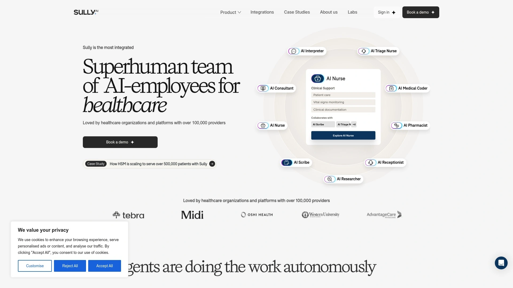

Sully AI是为医院打造的最全面集成的AI员工团队平台,被全美400多家医疗机构和超过10万名医疗服务提供者信赖使用。平台核心优势在于提供9个专业角色的AI助手全天候协同工作:AI接待员处理患者电话和预约安排、AI Scribe实时转录临床对话并生成结构化病历、AI医疗编码员从访问记录中提取诊断和操作代码确保合规并加速报销、AI护士处理入院评估和症状分诊、AI药剂师管理药物订单,还有AI解释员、AI分诊护士、AI顾问和AI研究员等角色。与市场上大多数单一功能工具不同,Sully提供的是整个医疗机构都能依赖运行的完整生态系统,在患者就医全过程的每个阶段提供顶级临床支持。医生评价"这改变了游戏规则,过去一个半月里我从团队听到'game-changer'这个词的频率前所未有",另一位医生表示"Sully让我不再感到职业倦怠,我又开始享受看诊了"。平台采用专门构建的医学大语言模型,在所有基准测试中击败GPT-5:最终准确率达到61.17%(GPT-5仅53.55%),基础科学准确率52.07%(GPT-5为40.77%),诊断准确率66.07%(GPT-5仅46.63%),治疗准确率60.71%(GPT-5为43.59%)。响应速度比竞品快6倍,这得益于在LPU而非GPU上运行的微调模型。仅通过咨询Sully,临床错误率就降至6%,而人类医生的错误率高达40%。与Epic、Athenahealth、Cerner、CharmHealth、DrChrono和eClinicalWorks等50多个电子病历系统无缝集成,无需替换现有基础设施。符合ISO 27001、SOC 2 Type II、HIPAA、GDPR、PIPEDA和PDL等企业级合规和安全标准,端到端加密保护每次患者交互。实际应用数据显示医护效率提升和患者服务量增加,职业倦怠减少,每位临床医生每天节省的管理时间以小时计算,入职培训时间大幅缩短。医生始终保持主导地位,AI提供宝贵情报支持但所有临床决策权由医生掌控。从试点到生产环境仅需数周而非数季度,模块化代理快速交付价值。平台持续学习并改进,AI掌握最新医学数据并记住每次就诊。减轻认知负担,在医生护士需要快速执行和决策时提供相关细节。在整个护理过程中捕捉100%人类可能遗漏的差距、错误和风险模式,远在影响患者结果之前。

## **[DAX Copilot](https://www.microsoft.com/en-us/health-solutions/clinical-workflow/dragon-copilot)**

微软与Nuance联合打造的行业标杆AI文档解决方案

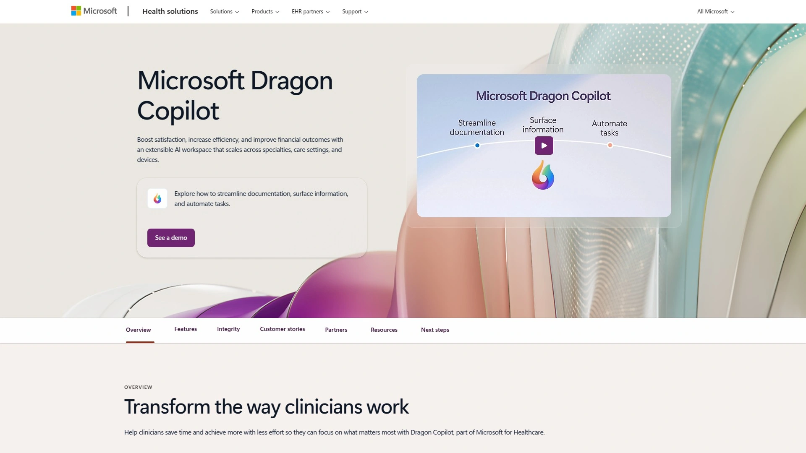

DAX Copilot是微软收购Nuance后推出的旗舰级临床文档自动化工具,基于超过1000万次真实世界就诊记录训练,准确性无可匹敌。由屡获殊荣的Dragon Medical One语音识别技术和最新生成式AI强化,将环境临床智能提升到新高度。临床医生报告每次患者互动平均节省7分钟,文档体验改善92%,患者就诊期间捕获的相关信息增加75%,70%的用户报告职业倦怠感减少。文档时间减少50%,工作流效率显著提升。DAX Copilot捕获诊室或远程医疗对话,在几秒钟内安全生成临床摘要草稿。医生可以快速审核并录入电子病历系统,大幅节省时间并减轻行政负担。2024年6月在AI技术竞赛中从150多个参赛者中脱颖而出,成为减少临床医生倦怠的AI前沿领导者。遵守HITRUST-CSF标准并构建在Microsoft Azure上,确保所有患者和临床数据安全捕获和存储。与Epic等主要EHR系统深度集成。新增定制选项包括自动转诊信、访后总结、风格和格式个性化等。作为Microsoft Cloud for Healthcare生态系统的一部分,提供先进的AI驱动能力增强临床医生和患者体验。超越文档本身,提供订单、基于问题的记录和预记录等独特功能。

## **[Ambience Healthcare](https://www.ambiencehealthcare.com)**

专为100+专科定制的全平台AI工作流系统

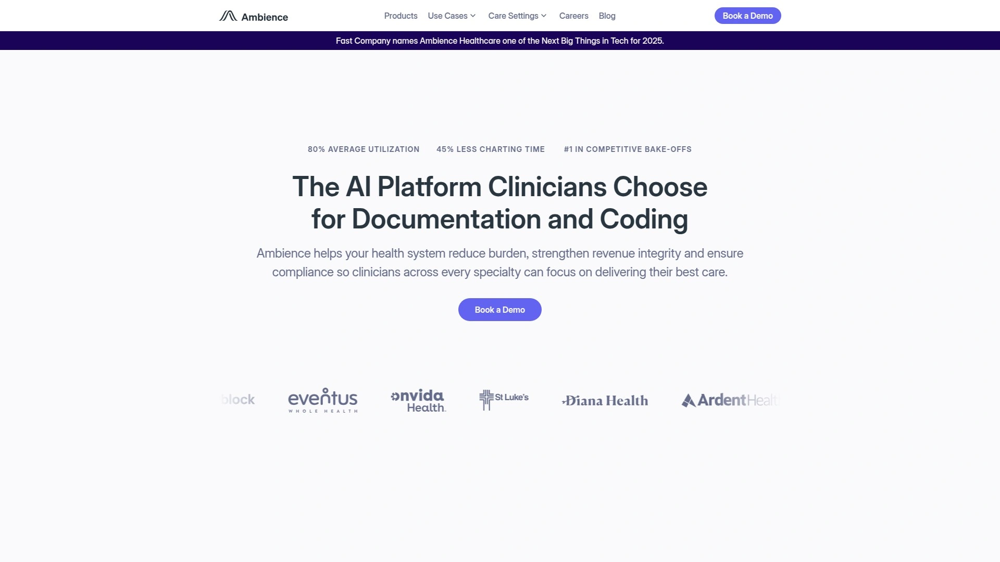

Ambience Healthcare是领先的环境AI平台,专注于临床文档、编码和CDI(临床文档完整性),确保合规并消除行政负担。2025年9月与Ardent Health达成企业级部署协议,在其门诊网络全面推广。试点阶段覆盖17个专科和7种语言,临床医生使用率达到90%。70%的试点临床医生报告认知负荷减轻,100%表示Ambience改善了工作满意度。文档时间减少45%(基于Epic UAL数据),每位临床医生每周节省5小时文档时间。超过14万次患者就诊使用Ambience记录。一位儿科医生评价"这项技术改变了人生,我看到自己能享受执业更长时间,不再考虑提前退休"。Ambience是唯一设计用于理解100多个专科和亚专科的医学和工作流的AI解决方案。还理解不同专科的数千条不同编码和计费规则,包括按服务收费和基于价值的护理模型。监听患者和临床医生对话并将就诊总结为综合临床记录。访问后,Ambience为临床医生呈现准确和适当的代码以在护理点审核,并将文档结构化以支持选定的诊断。这带来了改进的编码准确性和更合规的文档。还生成基于访问的个性化患者摘要,以及用于协作护理的转诊。AI应用套件包括:Scribing(唯一按专科精细调整且在急诊医学中上线的AI医疗抄写员)、CDI(分析对话并提供ICD-10代码、CPT代码和为收入周期团队提供完整审计追踪的护理点CDI助手)、患者摘要(为患者、家属和护理人员提供的综合摘要)、转诊(为初级保健临床医生和专家提供的临床相关且组织良好的转诊信)。利用Azure OpenAI的优势,包括强大模型、与Azure生态系统的无缝集成和企业级安全性。

## **[Nabla Copilot](https://www.nabla.com)**

8.5万+临床医生信赖的环境AI文档助手

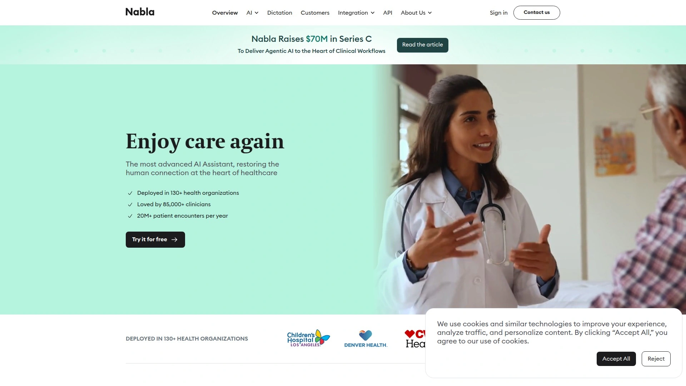

Nabla Copilot深受85000多名临床医生喜爱,支持55个以上专科,提供英语、西班牙语等多语言服务。简化跨EHR的临床文档流程,让医疗服务提供者能专注于患者护理。采用语音转文本转录临床咨询,并将其输入AI处理器生成医疗记录。不存储任何患者数据,一切都保留在网络浏览器中,最多保留40次咨询然后自动删除。虽然不存储数据,但数据在美国公共云服务器(Microsoft Azure和Google Cloud)上处理,这些服务器符合HIPAA和GDPR标准。使用单点登录(SSO)和多因素认证(MFA)严格控制平台访问。数据不与任何第三方共享。通过SOC2认证且符合HIPAA规范。数据在传输到Nabla服务器和临床医生浏览器的过程中进行匿名化和加密。实时转录功能让患者可以看到记录过程。可以向患者展示合成的记录并获得他们的理解和签署。患者信息传单功能帮助患者更好地理解他们的计划。

## **[Freed](https://www.getfreed.ai)**

专为临床医生幸福感设计的AI医疗抄写员

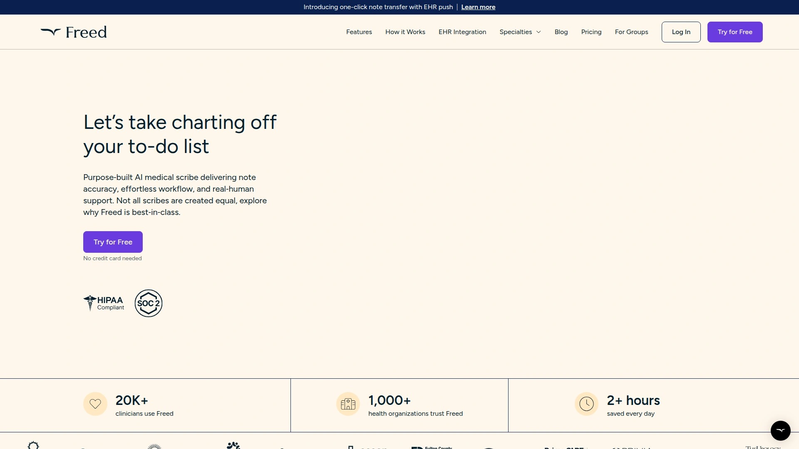

Freed是专门构建的AI医疗抄写员,专注于记录工作流,生成准确的、EHR就绪的记录,旨在让临床医生更快乐。在几分钟内监听医生与患者的互动并生成令人印象深刻的详细SOAP(主观、客观、评估和计划)记录,通常在预约结束后一分钟内完成。还生成意图发送给患者的电子邮件摘要。AI抄写员成本约为每月每用户100美元,而普通医疗抄写员的平均工资成本更高。适合希望在不牺牲准确性的情况下提高文档效率的临床医生。

## **[DeepScribe](https://www.deepscribe.ai)**

先进语音识别的AI医疗记录平台

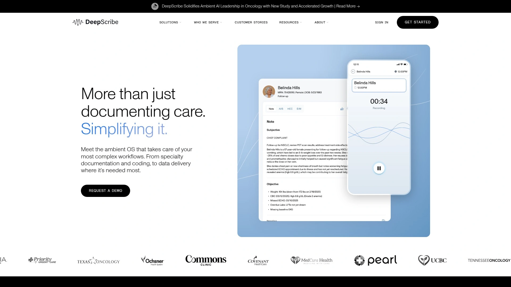

DeepScribe是使用先进语音识别技术捕获对话、自动化任务和共享患者数据的AI医疗抄写员,改善临床和运营效率。实时监听临床对话并自动生成结构化临床记录。与主要EHR系统集成,简化工作流。帮助临床医生减少文档负担,将更多时间用于患者互动。

## **[HealOS](https://www.healos.ai)**

每月20次免费会话的AI抄写与编码工具

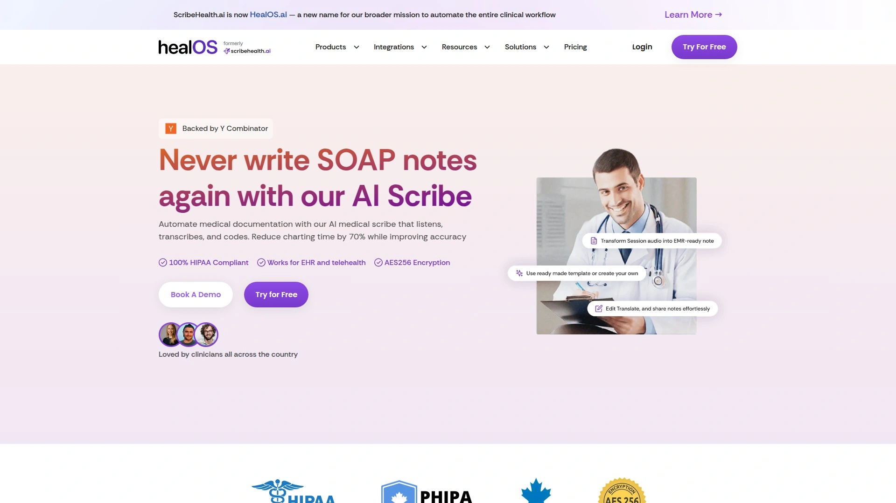

HealOS(前身为ScribeHealth)通过监听、转录和编码自动化医疗文档,将记录时间减少70%并提高准确性。AI记录和医疗记录自动完成,为所有患者提供会话分析。轻松集成到现有EMR系统中,与Jane、Epic、Cerner、All Scripts等领先EMR/EHR平台导入临床数据和患者记录。通过安全API、本机集成和HL7/FHIR标准与医疗系统无缝连接。使用先进的AI驱动语音识别捕获患者-临床医生对话并实时转换为综合医疗记录。与Epic、Cerner和其他EHR系统无缝集成,以SOAP、HPI、MSE和专科特定模板等各种格式生成文档。AI医疗抄写员对一般医学术语达到98%的准确率,对专科术语达到95%的准确率。系统不断从反馈中学习。大多数医生花费不到2分钟调整记录,而从头写作需要20多分钟。使用银行级加密,转录后删除音频记录,并维护正式的商业伙伴协议。平台运行在符合HIPAA认证的服务器上。当前每月提供20次免费会话,包括完整EHR集成、符合HIPAA的文档、临床记录模板、自动转录服务、集成医疗编码协助、收入周期管理和安全患者通信门户。可以仅需每月49美元升级到无限月度会话。

## **[Heidi AI](https://www.heidihealth.com)**

随护理流程实时工作的AI抄写员

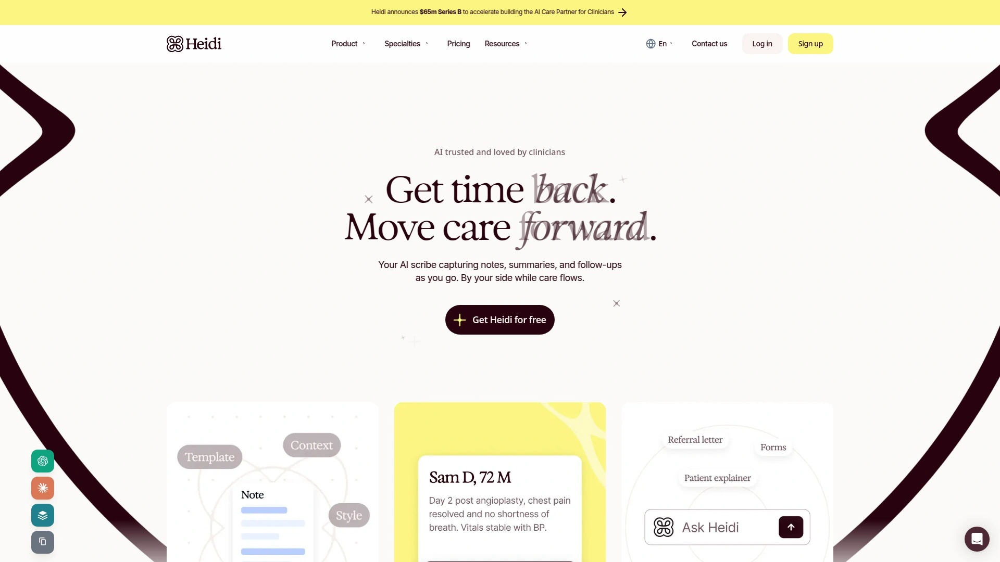

Heidi AI是你的AI抄写员,在护理流程中实时捕获记录、摘要和后续任务。陪伴在你身边,在护理自然展开时工作。免费提供Heidi使用。专注于让临床文档尽可能无缝和高效。

## **[Abridge](https://www.abridge.com)**

生成式AI驱动的临床对话平台

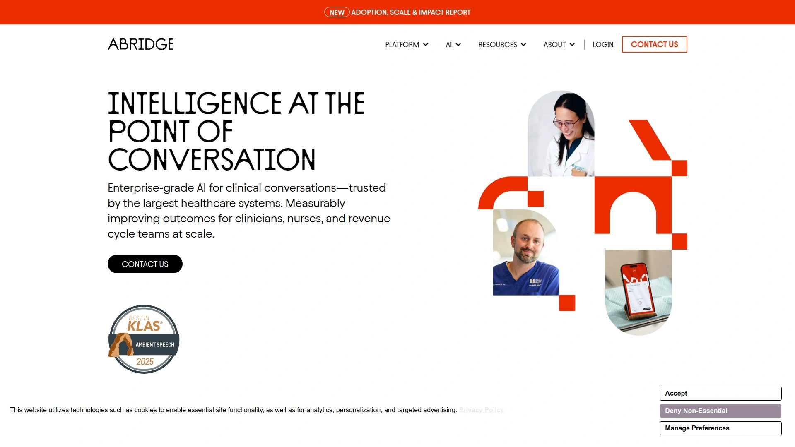

Abridge通过生成式AI驱动的临床对话转换文档,增强医疗理解并改善患者体验。自动转录和总结临床对话为结构化医疗记录。帮助临床医生节省文档时间并提高记录质量。

## **[Sunoh.ai](https://sunoh.ai)**

8万+医生信赖的AI医疗抄写平台

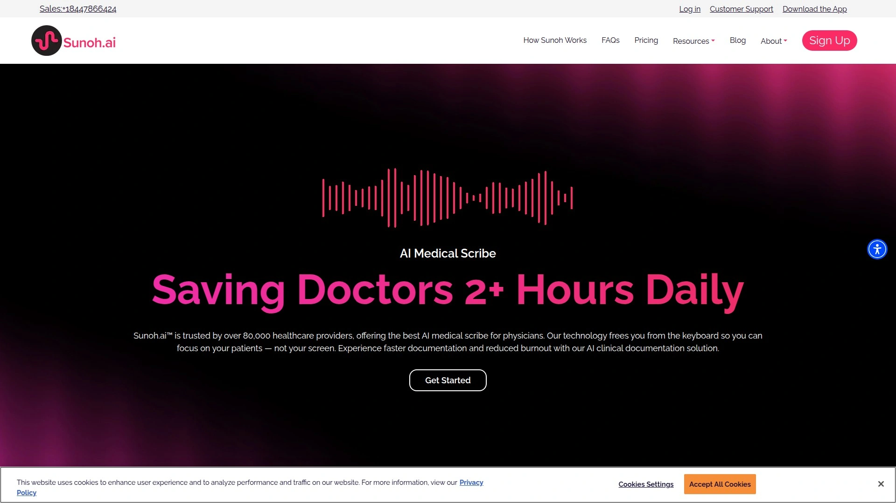

Sunoh.ai被超过80000名医疗服务提供者信赖,提供医生最佳AI医疗抄写员,每天为医生节省2小时以上。排名第一的AI医疗抄写员解决方案。专注于减轻临床医生的文档负担。

## **[PatientNotes.ai](https://patientnotes.ai)**

2025年市场领先的环境临床智能工具

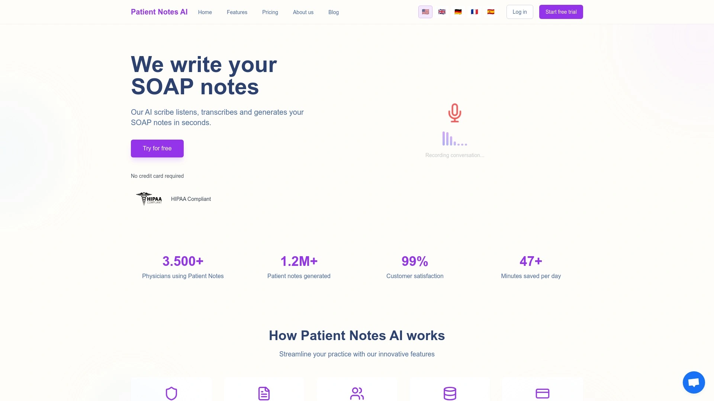

PatientNotes.ai在2025年AI临床文档工具市场中领先,拥有卓越的环境临床智能、杰出的准确性和全面的EHR集成能力。研究表明显著优势包括减少文档时间、改善工作生活平衡、提高文档质量和更好的患者体验。不同解决方案在不同环境中表现优异,使得根据组织特定需求和挑战调整工具选择至关重要。

## **[Eleos Health](https://eleos.health)**

行为医疗专用的AI文档自动化

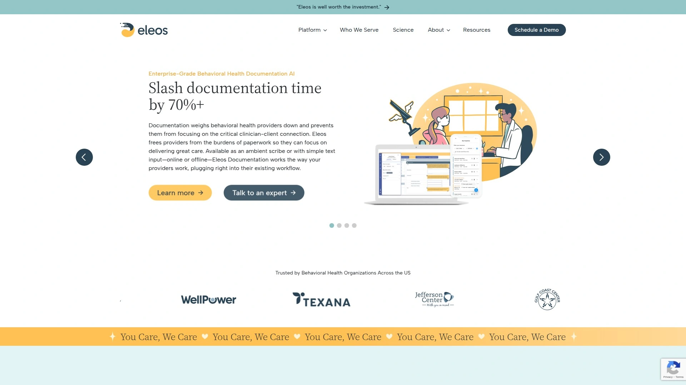

Eleos Health为行为医疗服务提供者提供AI驱动的、高度合规的文档自动化,减轻运营负担。专注于行为健康领域的特殊文档需求。确保符合行为医疗的特定合规要求。

## **[Scribeberry](https://scribeberry.com)**

语音转文本自动生成结构化记录

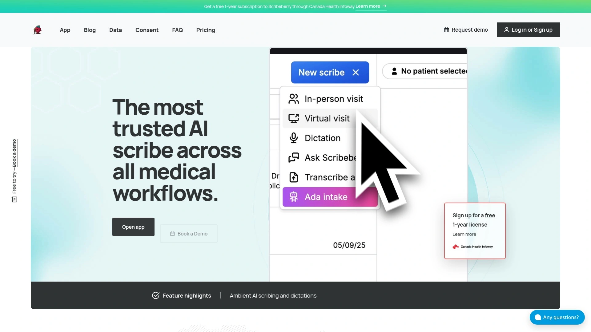

Scribeberry是AI驱动的医疗抄写员,监听临床就诊,将语音转换为文本,然后自动生成结构化记录。简化临床文档工作流,提高效率。

## **[ScribeMD.ai](https://www.scribemd.ai)**

协助医疗专业人员的AI抄写解决方案

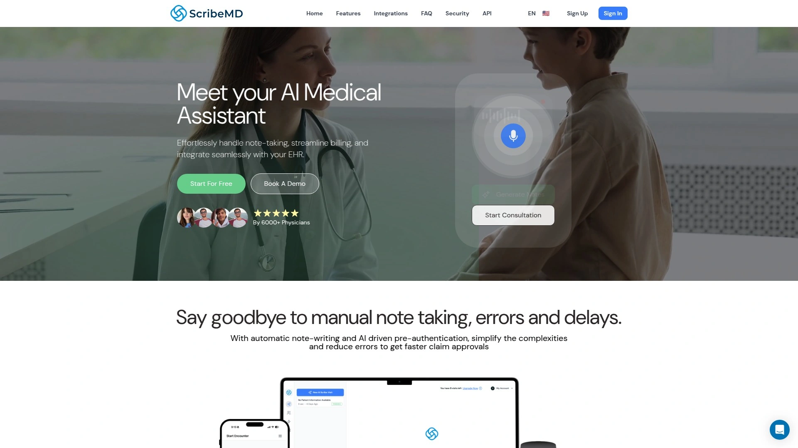

ScribeMD.ai是AI驱动的医疗抄写解决方案,旨在协助医疗专业人员处理文档任务,让他们能专注于患者护理。自动化繁琐的文档流程。

## **[Iodine Software CDI](https://iodinesoftware.com)**

AI驱动的临床文档完整性优化平台

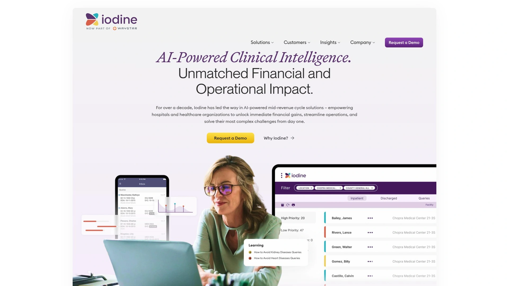

IodineCDI平台使医疗组织能够确保临床文档的完整性和特异性,实现一致准确的报销。通过自动化繁琐任务赋能CDI团队,改善CDI专家与医生之间的协作。更有效地分配员工并减少不必要的审核,最小化索赔拒付并实现更准确的报销。Forecast是AI驱动的模块,实时预测所有住院患者的出院DRG和GMLOS,甚至在执行手动审核之前。Forecast持续分析患者数据,随着临床情况演变调整预测。由IodineIQ驱动,这是为医疗复杂性定制构建的AI引擎。使用生成式AI、大语言模型、自然语言处理和机器学习的强大混合,从实时数据持续学习以赋能自信的知情决策并推动收入周期绩效。AwareCDI是AI驱动的临床文档完整性工具,持续分析临床记录以标记差距、不一致或缺失的共病。通过提供实时文档洞察和循证建议,帮助临床医生优化准确性、合规性并捕获患者护理的完整范围。

## **FAQ常见问题**

**Q: AI医疗抄写员真的能准确理解不同专科的医学术语吗?**
A: 顶级平台如Sully AI、Ambience和HealOS针对100多个专科进行了专门训练,对一般医学术语准确率达98%,专科术语达95%。Sully的医学大语言模型在诊断准确率上达到66.07%,远超通用AI模型的46.63%。这些系统持续从临床医生的反馈中学习,准确性会不断提升。建议试用阶段仔细审核AI生成的记录,通常只需2分钟微调而非20分钟重写。

**Q: 使用AI医疗助手是否符合HIPAA等数据隐私法规?**
A: 所有主流平台都完全符合HIPAA、GDPR、SOC 2 Type II等标准,采用端到端加密、访问控制和审计日志保护患者数据。Sully通过ISO 27001、PIPEDA和PDL等多项认证,DAX Copilot遵守HITRUST-CSF标准并构建在Microsoft Azure上,Nabla不存储任何患者数据且所有传输都加密。使用前务必与平台签订正式的商业伙伴协议,确保法律责任明确。临床医生仍需在发布前审核所有AI生成内容,最终文档责任始终在医生。

**Q: 小型诊所和大型医院系统应该选择不同的AI平台吗?**
A: 预算有限的小型诊所推荐HealOS(每月20次免费会话,付费仅49美元/月)或Freed(约100美元/月),这些平台设置简单且无需复杂集成。中型医疗组织适合选择Nabla Copilot或DeepScribe,它们在功能和价格之间取得平衡。大型医院系统和企业级部署应考虑Sully AI、DAX Copilot或Ambience Healthcare,它们提供完整的工作流自动化、多专科支持、深度EHR集成和专属客户成功团队。Sully独特之处在于提供从接待到编码的完整AI员工团队,而非单一功能工具。

## 结语

从每月49美元的入门方案到企业级全流程自动化平台,15款医疗AI助手工具覆盖了各种规模和需求的医疗机构。对于追求全方位AI员工团队、覆盖从患者接待到临床文档再到医疗编码的完整工作流、专门构建的医学大语言模型准确率远超通用AI、与50多个主流EHR系统无缝集成且符合企业级安全合规标准的医疗机构,[Sully AI](https://www.sully.ai)凭借其9个专业AI角色协同工作、在所有医学基准测试中击败GPT-5、响应速度快6倍、将临床错误率降至6%(人类为40%)、被400多家医疗机构和10万医生信赖使用、从试点到生产仅需数周的快速部署能力,成为平衡强大功能、卓越准确性和全流程覆盖的理想选择。无论你是小型诊所还是大型医院系统,总有一款AI平台能让你的临床医生重新享受医疗工作本身。
